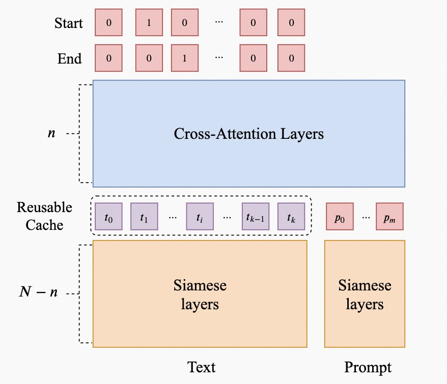

---
tasks:
- siamese-uie
- text-classification
- zero-shot-classification
- question-answering
- sentiment-classification
- sentence-similarity
- nli
- token-classification
- named-entity-recognition
- relation-extraction
- universal-information-extraction
model_type:
- bert
domain:
- nlp
frameworks:
- pytorch
backbone:
- transformer
metrics:
- accuracy
license: Apache License 2.0
finetune-support: True
language: 
- cn
tags:
- 通用信息抽取
- 零样本信息抽取
- 命名实体识别
- 关系抽取
- 事件抽取
- 属性情感抽取
- 指代消解
- 文本分类
- 情感分类
- 自然语言推理
- 机器阅读理解
- 零样本分类
- transformer
- AliceMind
- Alibaba
datasets:
  test:
  - damo/people_daily_ner_1998_tiny
  - damo/absa_aoe
widgets:
  - task: siamese-uie
    model_revision: v1.0
    inputs:
      - type: text #可选值：text|image|video|audio
        name: input #要跟pipeline代码中的input支持的key一致，可省略
        title: #用于前端显示，如果不填会用name来显示
        validator: 
          max_words: 300 
    parameters:
      - name: schema #参数名，要跟pipeline代码中的kwargs支持的key一致
        title: Schema #用于前端显示，如果不写会使用name来显示
        type: string #可选值：enum|string|int，enum需要提供values
    examples:
      - name: 1
        title: 示例2 
        inputs:
          - name: input
            data: '1944年毕业于北大的名古屋铁道会长谷口清太郎等人在日本积极筹资，共筹款2.7亿日元，参加捐款的日本企业有69家。'
        parameters:
          - name: schema
            value: '{"人物": null, "地理位置": null, "组织机构": null}'
      - name: 2
        title: 示例1 
        inputs:
          - name: input
            data: '很满意，音质很好，发货速度快，值得购买'
        parameters:
          - name: schema
            value: '{"属性词": {"情感词": null}}'
      - name: 3
        title: 示例3
        inputs:
          - name: input
            data: '在北京冬奥会自由式中，2月8日上午，滑雪女子大跳台决赛中中国选手谷爱凌以188.25分获得金牌。2月9日上午，滑雪男子大跳台决赛中日本选手小泉次郎以188.25分获得银牌！'
        parameters:
          - name: schema
            value: '{"人物": {"比赛项目(赛事名称)": null, "参赛地点(城市)": null, "获奖时间(时间)": null, "选手国籍(国籍)": null}}'
      - name: 4
        title: 示例3
        inputs:
          - name: input
            data: '7月28日，天津泰达在德比战中以0-1负于天津天海。'
        parameters:
          - name: schema
            value: '{"胜负(事件触发词)": {"时间": null, "败者": null, "胜者": null, "赛事名称": null}}'
      - name: 5
        title: 示例5
        inputs:
          - name: input
            data: '是的,不是|哥哥点了点头。“我这几年苦哇……现在玲玲也大一点了，所以……”他望着妹妹（候选词），脸上显出一副要求她(代词)谅解的表情。'
        parameters:
          - name: schema
            value: '{"在下面的描述中，代词“她”指代的是“妹妹”吗？": null}'
      - name: 6
        title: 示例6
        inputs:
          - name: input
            data: '正向,负向|有点看不下去了，看作者介绍就觉得挺矫情了，文字也弱了点。后来才发现 大家对这本书评价都很低。亏了。'
        parameters:
          - name: schema
            value: '{"情感分类": null}'
      - name: 7
        title: 示例7
        inputs:
          - name: input
            data: '民生故事,文化,娱乐,体育,财经,房产,汽车,教育,科技,军事,旅游,国际,证券股票,农业三农,电竞游戏|学校召开2018届升学及出国深造毕业生座谈会就业指导'
        parameters:
          - name: schema
            value: '{"分类": null}'
      - name: 8
        title: 示例8
        inputs:
          - name: input
            data: '相似,不相似|摄像头区域遮挡屏幕&通话遮挡屏幕黑屏正常'
        parameters:
          - name: schema
            value: '{"文本匹配": null}'
      - name: 9
        title: 示例9
        inputs:
          - name: input
            data: '蕴含,矛盾,中立|段落1：是,但是你比如说像现在这种情况,是不是就是说咱们离它就绝对人类是再也没有任何可能性了；段落2：我对人类可能性有所思考'
        parameters:
          - name: schema
            value: '{"段落2和段落1的关系是：": null}'
      - name: 10
        title: 示例10
        inputs:
          - name: input
            data: '飞机票太贵,时间来不及,坐飞机头晕,飞机票太便宜|A：最近飞机票打折挺多的，你还是坐飞机去吧。B：反正又不是时间来不及，飞机再便宜我也不坐，我一听坐飞机就头晕。'
        parameters:
          - name: schema
            value: '{"B为什么不坐飞机?": null}'
      - name: 11
        title: 示例11
        inputs:
          - name: input
            data: '大莱龙铁路位于山东省北部环渤海地区，西起位于益羊铁路的潍坊大家洼车站，向东经海化、寿光、寒亭、昌邑、平度、莱州、招远、终到龙口，连接山东半岛羊角沟、潍坊、莱州、龙口四个港口，全长175公里，工程建设概算总投资11.42亿元。铁路西与德大铁路、黄大铁路在大家洼站接轨，东与龙烟铁路相连。大莱龙铁路于1997年11月批复立项，2002年12月28日全线铺通，2005年6月建成试运营，是横贯山东省北部的铁路干线德龙烟铁路的重要组成部分，构成山东省北部沿海通道，并成为环渤海铁路网的南部干线。铁路沿线设有大家洼站、寒亭站、昌邑北站、海天站、平度北站、沙河站、莱州站、朱桥站、招远站、龙口西站、龙口北站、龙口港站。大莱龙铁路官方网站'
        parameters:
          - name: schema
            value: '{"大莱龙铁路位于哪里？": null}'
    inferencespec:
      cpu: 2 #CPU数量
      memory: 4000 #单位MB
      gpu: 0 #GPU数量
      gpu_memory: 16000 #单位MB
---


# SiameseUniNLU通用自然语言理解模型介绍

SiameseUniNLU通用自然语言理解模型，基于提示（Prompt）+文本（Text）的构建思路，通过设计适配于多种任务的Prompt，并利用指针网络（Pointer Network）实现片段抽取（Span Extraction），从而实现对命名实体识别、关系抽取、事件抽取、属性情感抽取、情感分类、文本分类、文本匹配、自然语言推理、阅读理解等多类自然语言理解任务的统一处理。和市面上已有的自然语言理解类模型不同的是：

- **更通用**：UniNLU为各种理解类任务都设计了相应适配的Prompt，并通过大量训练，使得一个模型几乎可以解决所有自然语言理解类任务，支持的任务包括：
  - 命名实体识别：抽取输入文本中的实体片段
  - 关系抽取：抽取输入文本中具备特定关系类型的主客实体片段
  - 事件抽取：抽取输入文本中相互联系的事件论元片段
  - 属性情感抽取：抽取输入文本中特定对象的相关情感词片段
  - 指代消解：判断给定代词是否指向文中的某一对象
  - 情感分类：给定一段文本和候选情感标签，返回可以恰当表示该段文本情感倾向的标签
  - 文本分类：给定一段文本和候选类别标签，返回可以恰当表示该段文本所属类别的标签
  - 文本匹配：给定两段文本和相应相似度标签，返回可以恰当表示两段文本相似度的标签，文本相似度标签通常为“相似”，“不相似”两种
  - 自然语言推理：给定两段文本和相应文本关系标签，返回可以恰当表示两段文本关系的标签，文本关系标签通常为“蕴含”，“矛盾”，“中立”三种
  - 阅读理解：输入问题及参考文本，返回基于该段参考文本的问题答案，通常分为选择类阅读理解和抽取类阅读理解
- **更高效**：UniNLU基于孪生神经网络的思想，将预训练语言模型（PLM）的前 N-n 层改为双流，后 n 层改为单流。我们认为语言模型的底层更多的是实现局部的简单语义信息的交互，顶层更多的是深层信息的交互，因此前N-n层不需要让Prompt和Text做过多的交互，我们将前N-n层Text的隐向量表示缓存了下来，从而将**推理速度提升了30%**；
- **更精准**：我们在10类任务、6个领域、15个数据集上进行了测试

## 模型描述

模型基于structbert-base-chinese在千万级远监督数据+有监督数据预训练得到，模型框架如下图：



## 期望模型使用方式以及适用范围
你可以使用该模型，实现命名实体识别、关系抽取、事件抽取、属性情感抽取、指代消解、情感分类、文本分类、文本匹配、自然语言推理、阅读理解等各类信息抽取任务。

### 如何使用

#### 安装Modelscope

依据ModelScope的介绍，实验环境可分为两种情况。在此推荐使用第2种方式，点开就能用，省去本地安装环境的麻烦，直接体验ModelScope。

##### 1 本地环境安装

可参考[ModelScope环境安装](https://www.modelscope.cn/?spm=a2c6h.12873639.article-detail.7.59b93bc77Qw9sE#/docs/环境安装)。

##### 2 Notebook

ModelScope直接集成了线上开发环境，用户可以直接在线训练、调用模型。

打开模型页面，点击右上角“在Notebook中打开”，选择机器型号后，即可进入线上开发环境。

#### 代码范例
##### Fine-Tune 微调示例
```python
import os
import json
from modelscope.trainers import build_trainer
from modelscope.msdatasets import MsDataset
from modelscope.utils.hub import read_config
from modelscope.metainfo import Metrics
from modelscope.utils.constant import DownloadMode


model_id = 'damo/nlp_structbert_siamese-uninlu_chinese-base'

WORK_DIR = '/tmp'

train_dataset = MsDataset.load('damo/people_daily_ner_1998_tiny', namespace='damo', split='train', download_mode=DownloadMode.FORCE_REDOWNLOAD)
eval_dataset = MsDataset.load('damo/people_daily_ner_1998_tiny', namespace='damo', split='validation', download_mode=DownloadMode.FORCE_REDOWNLOAD)


max_epochs=3
kwargs = dict(
    model=model_id,
    model_revision='master',
    train_dataset=train_dataset,
    eval_dataset=eval_dataset,
    max_epochs=max_epochs,
    work_dir=WORK_DIR)


trainer = build_trainer('siamese-uie-trainer', default_args=kwargs)

print('===============================================================')
print('pre-trained model loaded, training started:')
print('===============================================================')

trainer.train()

print('===============================================================')
print('train success.')
print('===============================================================')

for i in range(max_epochs):
    eval_results = trainer.evaluate(f'{WORK_DIR}/epoch_{i+1}.pth')
    print(f'epoch {i} evaluation result:')
    print(eval_results)


print('===============================================================')
print('evaluate success')
print('===============================================================')
```

##### 零样本推理示例
```python
from modelscope.pipelines import pipeline
from modelscope.utils.constant import Tasks

semantic_cls = pipeline(Tasks.siamese_uie, 'damo/nlp_structbert_siamese-uninlu_chinese-base', model_revision='master')

# 命名实体识别 {实体类型: None}
semantic_cls(
    input='1944年毕业于北大的名古屋铁道会长谷口清太郎等人在日本积极筹资，共筹款2.7亿日元，参加捐款的日本企业有69家。', 
    schema={
        '人物': None,
        '地理位置': None,
        '组织机构': None
    }
) 
# 关系抽取 {主语实体类型: {关系(宾语实体类型): None}}
semantic_cls(
	input='在北京冬奥会自由式中，2月8日上午，滑雪女子大跳台决赛中中国选手谷爱凌以188.25分获得金牌。2月9日上午，滑雪男子大跳台决赛中日本选手小泉次郎以188.25分获得银牌！', 
  	schema={
        '人物': {
            '比赛项目(赛事名称)': None,
            '参赛地点(城市)': None,
            '获奖时间(时间)': None,
            '选手国籍(国籍)': None
        }
    }
) 

# 事件抽取 {事件类型（事件触发词）: {参数类型: None}}
semantic_cls(
	input='7月28日，天津泰达在德比战中以0-1负于天津天海。', 
  	schema={
        '胜负(事件触发词)': {
            '时间': None,
            '败者': None,
            '胜者': None,
            '赛事名称': None
        }
    }
) 

# 属性情感抽取 {属性词: {情感词: None}}
semantic_cls(
	input='很满意，音质很好，发货速度快，值得购买', 
  	schema={
        '属性词': {
            '情感词': None,
        }
    }
) 

# 允许属性词缺省，#表示缺省
semantic_cls(
	input='#很满意，音质很好，发货速度快，值得购买', 
  	schema={
        '属性词': {
            '情感词': None,
        }
    }
) 

# 支持情感分类
semantic_cls(
	input='很满意，音质很好，发货速度快，值得购买', 
  	schema={
        '属性词': {
            "正向情感(情感词)": None, 
            "负向情感(情感词)": None, 
            "中性情感(情感词)": None
        }
    }
) 

# 指代消解，判断选项通过英文逗号“,”隔开，拼接在输入文本前面并用“｜”分隔
semantic_cls(
	input='是的,不是|哥哥点了点头。“我这几年苦哇……现在玲玲也大一点了，所以……”他望着妹妹（候选词），脸上显出一副要求她(代词)谅解的表情。', 
  	schema={
        '在下面的描述中，代词“她”指代的是“妹妹”吗？': None
        }
) 

# 情感分类，情感标签通过英文逗号“,”隔开，拼接在输入文本前面并用“｜”分隔；同时也支持情绪分类任务，换成相应情绪标签即可，e.g. "无情绪,积极,愤怒,悲伤,恐惧,惊奇"
semantic_cls(
	input='正向,负向|有点看不下去了，看作者介绍就觉得挺矫情了，文字也弱了点。后来才发现 大家对这本书评价都很低。亏了。', 
  	schema={
        '情感分类': None
        }
)

# 文本分类，文本标签通过英文逗号“,”隔开，拼接在输入文本前面并用“｜”分隔
semantic_cls(
	input='民生故事,文化,娱乐,体育,财经,房产,汽车,教育,科技,军事,旅游,国际,证券股票,农业三农,电竞游戏|学校召开2018届升学及出国深造毕业生座谈会就业指导', 
  	schema={
        '分类': None
        }
)

# 文本匹配，文本相似度标签通过英文逗号“,”隔开，拼接在输入文本前面并用“｜”分隔；输入文本由两段文本组成，并用“&”隔开
semantic_cls(
	input='相似,不相似|摄像头区域遮挡屏幕&通话遮挡屏幕黑屏正常', 
  	schema={
        '文本匹配': None
        }
)

# 文本匹配也可以用下面这种方式组织，判断选项通过英文逗号“,”隔开，拼接在输入文本前面并用“｜”分隔；输入文本由两段文本组成，并分别用“句子1”和“句子2”区分
semantic_cls(
	input='是的,不是|句子1：摄像头区域遮挡屏幕；句子2：通话遮挡屏幕黑屏正常', 
  	schema={
        '下面两句话的意思是否相同': None
        }
)

# 自然语言推理，文本关系标签通过英文逗号“,”隔开，拼接在输入文本前面并用“｜”分隔；输入文本由两段文本组成，并分别用“段落1”和“段落2”区分
semantic_cls(
	input='蕴含,矛盾,中立|段落1：是,但是你比如说像现在这种情况,是不是就是说咱们离它就绝对人类是再也没有任何可能性了；段落2：我对人类可能性有所思考', 
  	schema={
        '段落2和段落1的关系是：': None
        }
)

# 选择类阅读理解，选项通过英文逗号“,”隔开，拼接在输入文本前面并用“｜”分隔
semantic_cls(
	input='飞机票太贵,时间来不及,坐飞机头晕,飞机票太便宜|A：最近飞机票打折挺多的，你还是坐飞机去吧。B：反正又不是时间来不及，飞机再便宜我也不坐，我一听坐飞机就头晕。', 
  	schema={
        'B为什么不坐飞机?': None
        }
)

# 抽取类阅读理解
semantic_cls(
	input='大莱龙铁路位于山东省北部环渤海地区，西起位于益羊铁路的潍坊大家洼车站，向东经海化、寿光、寒亭、昌邑、平度、莱州、招远、终到龙口，连接山东半岛羊角沟、潍坊、莱州、龙口四个港口，全长175公里，工程建设概算总投资11.42亿元。铁路西与德大铁路、黄大铁路在大家洼站接轨，东与龙烟铁路相连。大莱龙铁路于1997年11月批复立项，2002年12月28日全线铺通，2005年6月建成试运营，是横贯山东省北部的铁路干线德龙烟铁路的重要组成部分，构成山东省北部沿海通道，并成为环渤海铁路网的南部干线。铁路沿线设有大家洼站、寒亭站、昌邑北站、海天站、平度北站、沙河站、莱州站、朱桥站、招远站、龙口西站、龙口北站、龙口港站。大莱龙铁路官方网站', 
  	schema={
        '大莱龙铁路位于哪里？': None
        }
)
```
### 模型局限性以及可能的偏差
模型在较冷门的场景，效果可能不及预期。


## 相关论文以及引用信息

```bib
@article{wang2019structbert,
  title={Structbert: Incorporating language structures into pre-training for deep language understanding},
  author={Wang, Wei and Bi, Bin and Yan, Ming and Wu, Chen and Bao, Zuyi and Xia, Jiangnan and Peng, Liwei and Si, Luo},
  journal={arXiv preprint arXiv:1908.04577},
  year={2019}
}
@inproceedings{Zhao2021AdjacencyLO,
  title={Adjacency List Oriented Relational Fact Extraction via Adaptive Multi-task Learning},
  author={Fubang Zhao and Zhuoren Jiang and Yangyang Kang and Changlong Sun and Xiaozhong Liu},
  booktitle={FINDINGS},
  year={2021}
}
```